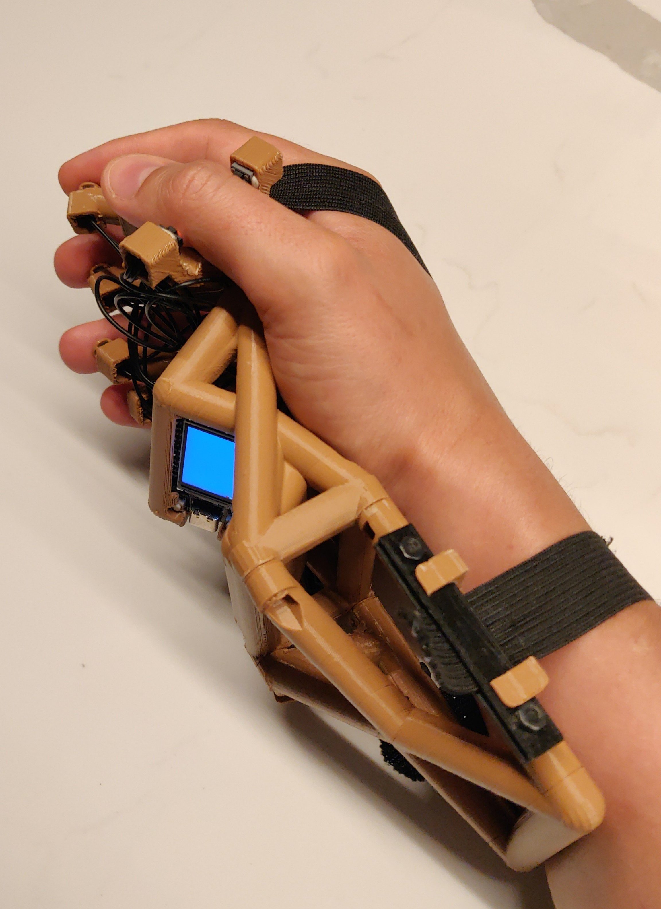

# s-chorder

This is a [chording keyboard project](https://en.wikipedia.org/wiki/Chorded_keyboard). In short, it's a device that allows you to type one-handed and with minimal movement.

## Why?

Chording keyboards fill certain niches.

* They are perfect for wearable computing which [Greg Priest-Dorman has practised for a number of years](https://www.cs.vassar.edu/people/priestdo/wearables/top). Indeed, his and [Mikkel Holm Olsen's SpiffChorder](https://chorder.cs.vassar.edu/doku.php?id=spiffchorder:hardware) served as inspiration for this project.
* They allow usage in the blind. This opens up for certain use cases, including note taking in the dark and in situations calling for inconspicuousness (if you can get past the bit about having something attached to your hand, that is).
* They can aid people with RSI related injuries by providing an alternative typing system, or a system that makes use of a remaining limb.

# How would I go about making one myself?

The model OpenSCAD file [is parametric to a ridiculous degree](https://github.com/skrewz/s-chorder/blob/master/chorder.scad#L33-L71). The idea is that one is supposed to be able to plop one's own measurements into it, and it'd generate a 3D model that fits a hand with such measurements. We may, however, have strayed from that ideal at this point, and yours truly, by the nature of things, has only had the need to produce models for one specific geometry.

If you find yourself trying this out, I'd recommend one of two approaches, or a combination of them:

1. Try measuring your finger segment lengths. They are measured on a bent finger (i.e. one that exposes 90 degree angles on both ends of the segment) and measured like a caliper would; externally. The finger radii should handle the difference from external measurement to where the joint pivots. This might provide a starting point, but, ultimately, you'll also be...:
2. Find some economic slicing settings for your slicer and acknowledge you will get it wrong. I find that it's worth printing another version even for single millimetres of incorrect location, so it pays to print a whole lot of single-shelled-5%-infill sorts of budget prints.

At any rate, make sure you make a git commit in your fork for every time you print a prototype. This'll help greatly in terms of knowing what you've changed. And please let me know what sort of tweaks you've had to do—maybe it can be better integrated into the model's calculations.

## Actually printing it

The `finger_end` will need a lot of support. It's essentially printed on supports. I've had good mileage with two raft layers and playing with Prusa-Slic3r's support enforcers.

The `body` and `wrist_handle` can be printed standing on their connecting surfaces, although the `body` is likely to need a fair bit of support for the bits that eventually will be under the index finger.

The `body` and `finger_end` modules derive their connection points from the same finger geometry measurements, so if they change, you'll likely need to print a new version of both. The `wrist_handle` module is fairly fixed and won't need much fine-tuning.

## Electronics and firmware

I would recommend using a TTGO T-Display for this project. It has battery capability, charges off USB-C and allows some nice features surrounding note-taking. I bought [this product for the project](https://www.aliexpress.com/item/1005001343590866.html).

The model is based on 6mm×6mm buttons (seemingly for computer mice?). I used [these ones from AliExpress](https://www.aliexpress.com/item/32653516999.html). The straps are made from the elastic/silicone tape that's meant to be sown into garments for invisible hold. You'll probably also want to solder some long-ish Dupont cables.

I've developed [a firmware for my purposes](https://github.com/skrewz/esp-idf-chorderfw). It's a bit of a work in progress, though.

# Contact

Well. My email address is in the git commit history, right? 🙂
